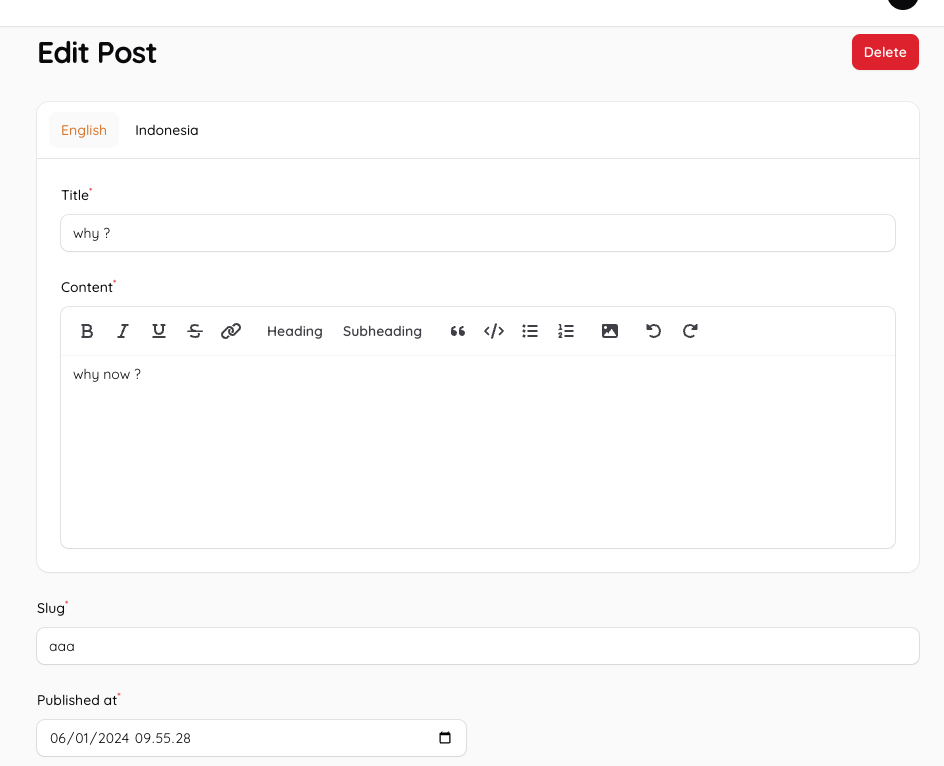

We will use this package to manage database multiple language implementation

```bash
composer require richan-fongdasen/laravel-i18n: "^3.2"
```

full documentation is [here](https://laravel-i18n.richan.id/package-installation)

## lets try an example create a posts

form preview :



using blueprint package create `draft.yaml` file in root directory

```yaml
models:
  Post:
    slug: string nullable
    published_at: datetime nullable
  PostTranslations:
    post_id: unsigned big integer
    locale: string
    title: string
    content: text
    timestamps: false
    relationships:
      BelongsTo: Post
```

then run

```bash
php artisan blueprint:build draft.yml
```

this will generate migrations, models and factories file

lets change `storage/i18n/languages.json` file content to this :

```json
[
    {
        "name": "English",
        "language": "en",
        "country": "US"
    },
    {
        "name": "Indonesian",
        "language": "id",
        "country": "ID"
    }
]
```

adjust `app/Models/Post` like this

```php linenums="1" hl_lines="7-8 10 13 35-38"
<?php

namespace App\Models;

use Illuminate\Database\Eloquent\Factories\HasFactory;
use Illuminate\Database\Eloquent\Model;
use RichanFongdasen\I18n\Contracts\TranslatableModel;
use RichanFongdasen\I18n\Eloquent\Concerns\Translatable;

class Post extends Model implements TranslatableModel
{
    use HasFactory;
    use Translatable;

    /**
     * The attributes that are mass assignable.
     *
     * @var array
     */
    protected $fillable = [
        'slug',
        'published_at',
    ];

    /**
     * The attributes that should be cast to native types.
     *
     * @var array
     */
    protected $casts = [
        'id' => 'integer',
        'published_at' => 'datetime',
    ];

    protected array $translates = [
        'title',
        'content'
    ];
}
```

lets run

```bash
php artisan migrate
```

to generate `posts` and `post_translations` tables

then run

```bash
php artisan make:filament-resource -G
```

type `Post` to generate post resources

to create post translation data adjust class `app/Filament/Resources/PostResource.php`,
edit form function like this :

```php linenums="1" hl_lines="5-28"
public static function form(Form $form): Form
{
    return $form
        ->schema([
            Tabs::make('lang')
                ->columnSpanFull()
                ->tabs([
                    Tab::make('English')
                        ->schema([
                            Forms\Components\TextInput::make('title.en')
                                ->label('Title')
                                ->required(),
                            Forms\Components\RichEditor::make('content.en')
                                ->label('Content')
                                ->required()
                                ->maxLength(65535),
                        ]),
                    Tab::make('Indonesia')
                        ->schema([
                            Forms\Components\TextInput::make('title.id')
                                ->label('Title')
                                ->required(),
                            Forms\Components\RichEditor::make('content.id')
                                ->label('Content')
                                ->required()
                                ->maxLength(65535),
                ]),
            ]),
            Forms\Components\TextInput::make('slug')
                ->columnSpanFull()
                ->required()
                ->maxLength(255),
            Forms\Components\DateTimePicker::make('published_at')
                ->required(),
        ]);
}
```

to load post translation data when editing a post, you can change
class `app/Filament/Resources/PostResource/Pages/EditPost.php` and add a function `mutateFormDataBeforeFill` like this :

```php linenums="1"
protected function mutateFormDataBeforeFill(array $data): array
{
    $locales = app(I18nService::class)->getAllLocale();
    $localeKey = config('i18n.language_key', 'language');

    $attributes = $this->record->getTranslatableAttributes();
    foreach ($locales as $item) {
        $this->record->translateTo($item->{$localeKey});
        foreach ($attributes as $attribute) {
            $data[$attribute][$item->{$localeKey}] = $this->record->{$attribute};
        }
    }
    return $data;
}
```
